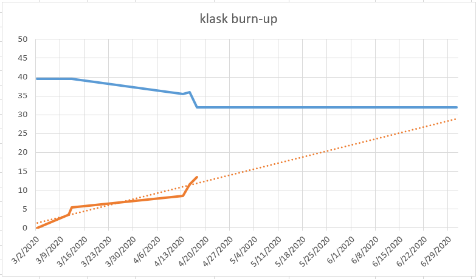
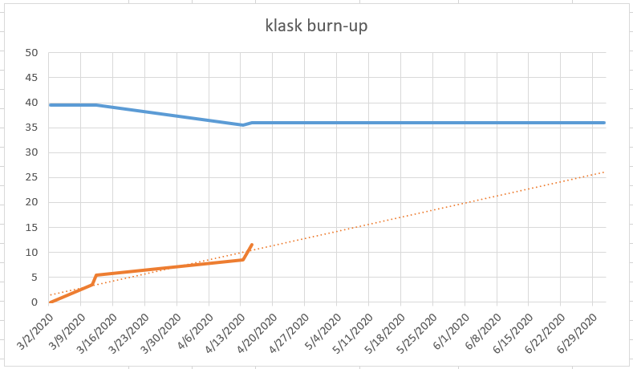
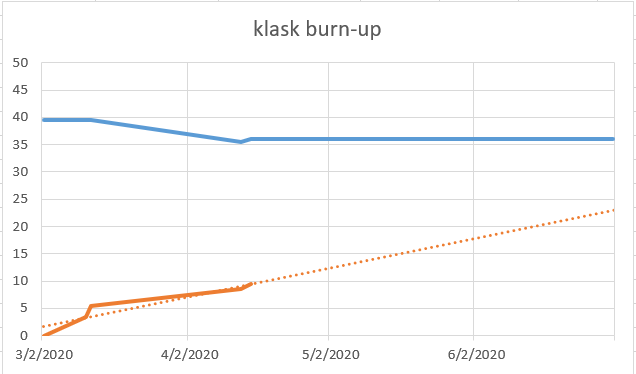
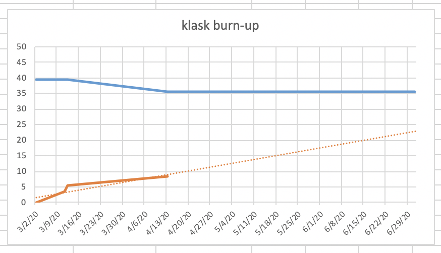
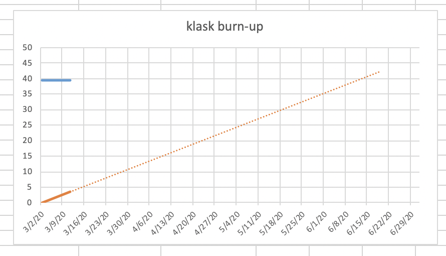

# klask
```
Tracking burn-up charts and commentary in reverse chronological order...
```

## 2020-04-20
* Found that setup-game and game-scoring have the same amount of work
* Decided the action sheet for the game-scoring page, for now...
* Thinking phone parallel vs perpendicular to the board


## 2020-04-17
* Most klask points page completed w/ navigation
* Join tourney page completed, might be changed later
* Setup game and actual in game page work beginning
* Took out some stats pages as well, sticking with leaderboard and most Klasks for now



## 2020-04-15 (update 2)
* Finished home page
* Beginning work on join tournament page



## 2020-04-15
* Finished leaderboard
* Beginning work on booby prize for most klasks



## 2020-04-13
* Scramble to get this project back up and running
* Removed some un-essential items
* Will be losening our definition of "done"
* We're "in it to win it" : - )




## 2020-03-12
* Did our mob programming tasks just before spring break and the pandemic


## 2020-03-11
* Just getting started...


